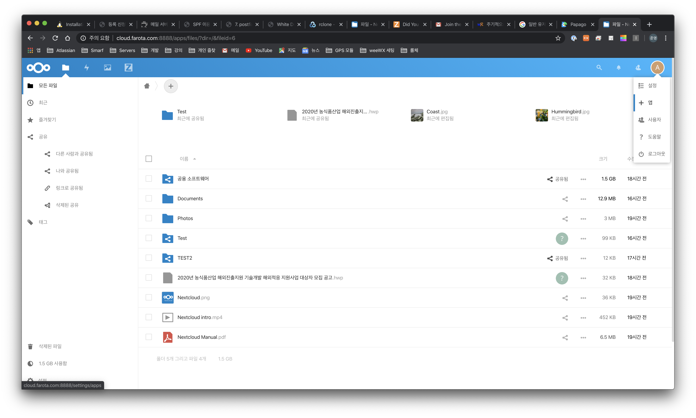

# How to install NextCloud using docker

This docker-image is made for private own use so it won't be updated periodically.

Features of the image is bellow.

### Features

- Based on Alpine Linux.
- Bundled with nginx and PHP 7.x (wonderfall/nginx-php image).
- Automatic installation using environment variables.
- Package integrity (SHA512) and authenticity (PGP) checked during building process.
- Data and apps persistence.
- OPCache (opcocde), APCu (local) installed and configured.
- system cron task running.
- MySQL, PostgreSQL (server not built-in) and sqlite3 support.
- Redis, FTP, SMB, LDAP, IMAP support.
- GNU Libiconv for php iconv extension (avoiding errors with some apps).
- No root processes. Never.
- Environment variables provided (see below).

### Environment variables

- **UID** : nextcloud user id *(default : 991)*
- **GID** : nextcloud group id *(default : 991)*
- **UPLOAD_MAX_SIZE** : maximum upload size *(default : 10G)*
- **APC_SHM_SIZE** : apc memory size *(default : 128M)*
- **OPCACHE_MEM_SIZE** : opcache memory size in megabytes *(default : 128)*
- **MEMORY_LIMIT** : php memory limit *(default : 512M)*
- **CRON_PERIOD** : time interval between two cron tasks *(default : 15m)*
- **CRON_MEMORY_LIMIT** : memory limit for PHP when executing cronjobs *(default : 1024m)*
- **TZ** : the system/log timezone *(default : Etc/UTC)*
- **ADMIN_USER** : username of the admin account *(default : none, web configuration)*
- **ADMIN_PASSWORD** : password of the admin account *(default : none, web configuration)*
- **DOMAIN** : domain to use during the setup *(default : localhost)*
- **DB_TYPE** : database type (sqlite3, mysql or pgsql) *(default : sqlite3)*
- **DB_NAME** : name of database *(default : none)*
- **DB_USER** : username for database *(default : none)*
- **DB_PASSWORD** : password for database user *(default : none)*
- **DB_HOST** : database host *(default : none)*

Don't forget to use a **strong password** for the admin account!

### Port

- **8888** : HTTP Nextcloud port.

### Volumes

- **/data** : Nextcloud data.
- **/config** : config.php location.
- **/apps2** : Nextcloud downloaded apps.
- **/nextcloud/themes** : Nextcloud themes location.
- **/php/session** : php session files.


--------------------

### Prerequisites

1. docker
2. docker-compose


### 1. Create directories for docker external volumes.

```bash
# Create docker-volumes
$ sudo mkdir -p ./docker/nextcloud/db
$ sudo mkdir -p ./docker/nextcloud/data
$ sudo mkdir -p ./docker/nextcloud/config
$ sudo mkdir -p ./docker/nextcloud/apps
$ sudo mkdir -p ./docker/nextcloud/themes
$ sudo chown -R smarf:smarf /docker/nextcloud
```


### 2. Create `docker-compose.yml`

Create `docker-compose.yml` file and Fill out the bellow contents.

```yaml
version: '2'

networks:
  nextcloud_network:
    external: false

services:
  nextcloud:
    image: wonderfall/nextcloud:17
    container_name: nextcloud
    privileged: true
    depends_on:
      - db_nextcloud # If using MySQL
      # - redis # If using Redis
    environment:
      - UID=1000
      - GID=1000
      - UPLOAD_MAX_SIZE=10G
      - APC_SHM_SIZE=128M
      - OPCACHE_MEM_SIZE=128
      - CRON_PERIOD=15m
      - TZ=Asia/Seoul
      - ADMIN_USER=admin # Don't set to configure through browser
      - ADMIN_PASSWORD=uiop90-= # Don't set to configure through browser
      - DOMAIN=cloud.smarf.kr
      - DB_TYPE=mysql
      - DB_NAME=nextcloud
      - DB_USER=nextcloud
      - DB_PASSWORD=uiop90-=
      - DB_HOST=db_nextcloud
    ports:
      - "8888:8888"
    volumes:
      - ./docker/nextcloud/data:/data:rw
      - ./docker/nextcloud/config:/config:rw
      - ./docker/nextcloud/apps:/apps2:rw
      - ./docker/nextcloud/themes:/nextcloud/themes:rw
    networks:
      - nextcloud_network
  # If using MySQL
  db_nextcloud:
    image: mariadb
    container_name: db_nextcloud
    privileged: true
    volumes:
      - ./docker/nextcloud/db:/var/lib/mysql:rw
    environment:
      - MYSQL_ROOT_PASSWORD=uiop90-=
      - MYSQL_DATABASE=nextcloud
      - MYSQL_USER=nextcloud
      - MYSQL_PASSWORD=uiop90-=
    networks:
      - nextcloud_network

  # # If using Redis
  # redis:
  #   image: redis:alpine container_name: redis volumes:
  #     - /docker/nextcloud/redis:/data networks:
  #     - nextcloud_network

```


### 3. Run docker-compose

Run the command line for execute NextCloud, but It should be executed with normal user.

``` bash
$ docker-compose up -d
```


### 4. Add ZimbraDrive app in NextCloud.

Go to this URL : https://apps.nextcloud.com/apps/zimbradrive and Download `zimbradrive.tar.gz` file

Once Zimbradrive is downloaded then extract this tar.gz file and move to app's folder

```bash
$ sudo wget https://apps.nextcloud.com/apps/zimbradrive
$ sudo tar xzvf zimbradrive.tar.gz
$ sudo mv zimbradrive {nextcloud dir}/docker/nextcloud/apps/
```

Restart NextCloud.

```bash
~{docker-compose.yml dir} $ docker-compose
```


### 5. Configure zimbradrive app.

Move to app menu and Find Zimbra Drive to set status to `used`.  



Move to Setting menu and Move to Zimbra Drive menu.

See how to set zimbradrive in zimbra( [Zimbra, Installation Guide.md](Zimbra, Installation Guide.md) )