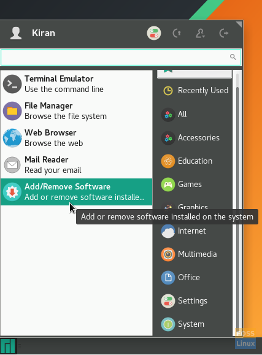
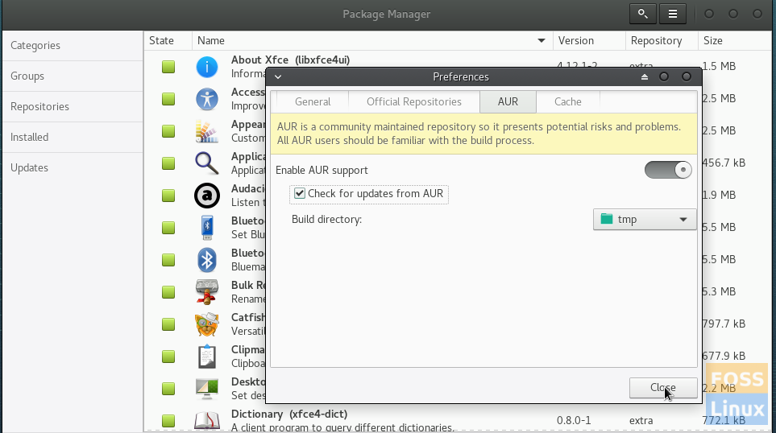

## How to use Package Manager in MANJARO OS 

### 1. GUI Way

1. Click the start menu and select ‘Add/Remove Software,’ which is nothing but ‘Package Manager.’

   

2. In the ‘Package Manager,’ click on the breadcrumb and select ‘Preferences.’

3. Click on the ‘AUR’ tab. It is the Arch User Repository where you will find hundreds of community developed packages. The package maintainer uses Package Helper to download the browser from Google servers and compiles it for Arch Linux based distros. It is trustworthy for seven years or so. So don’t worry – it is safe.



4. Enable AUR support by turning ON the slider button. Also, check the box ‘Check for updates from AUR.’ Click ‘Close.’

### 2. Using command-line from the Terminal

1. Install git using the following command:

```bash
sudo pacman -S git
```

2. Go to [Arch Linux AUR page](https://aur.archlinux.org/packages/google-chrome/) and copy the Git Clone URL.

3. Enter *git* and paste the URL by right-clicking paste.

```bash
#example : google chrome
git https://aur.archlinux.org/google-chrome.git
```

4. Use *cd* commands to navigate to the *“Downloads”>”google-chrome”* directory. And build the package from the source using *makepkg* command:

```bash
cd git_repository
cd google-chrome
makepkg -s
```

5. The package is built in the google-chrome directory with extension *.tar.xz*. Let’s install it using *pacman*.

```bash
sudo pacman -U google-chrome*.tar.xz
```

