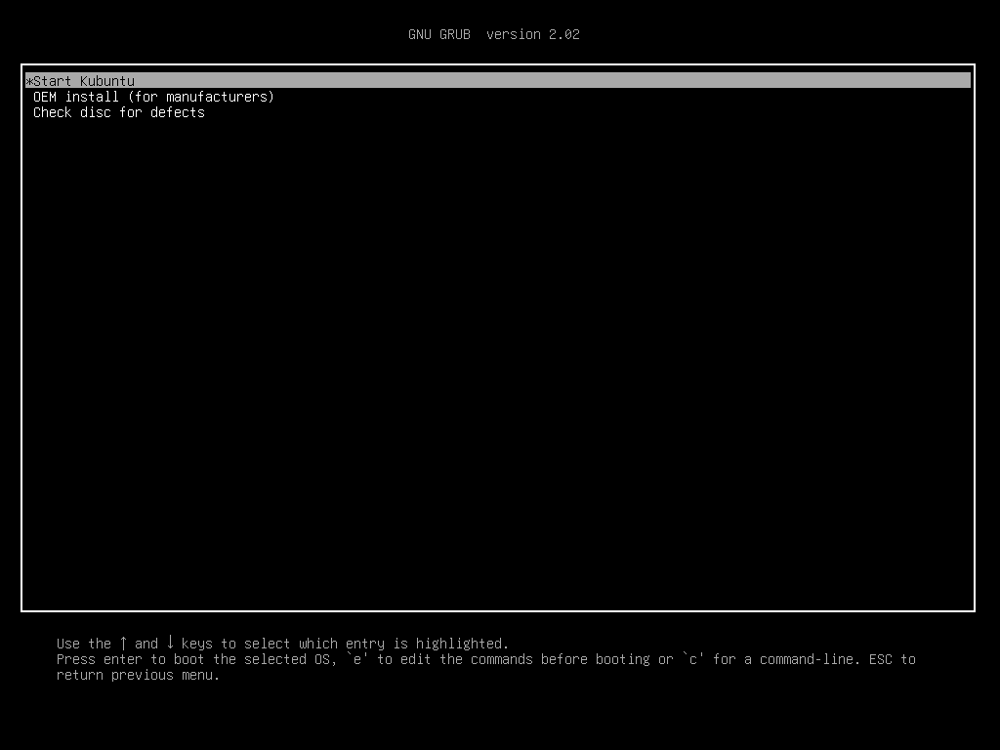
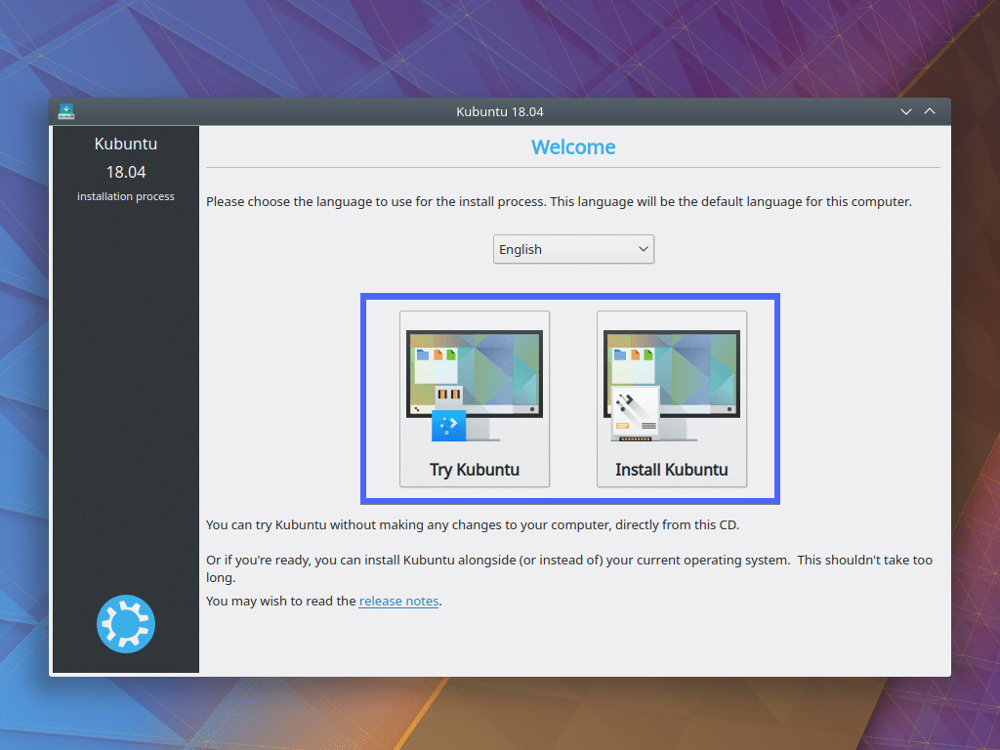
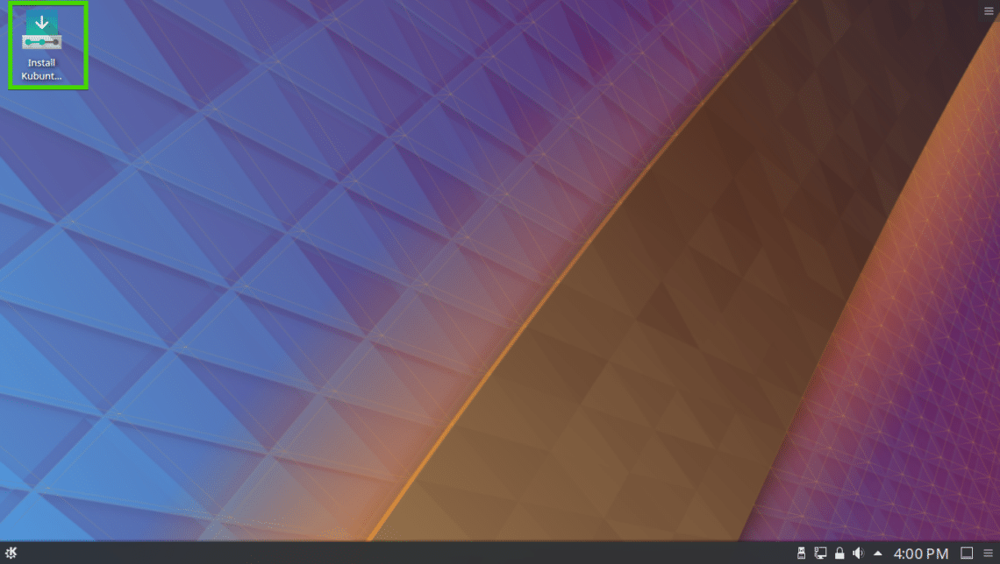
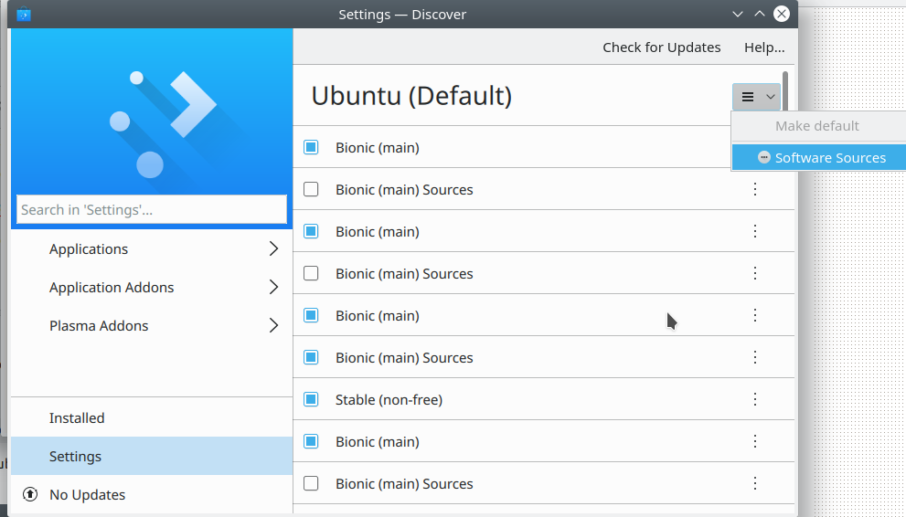
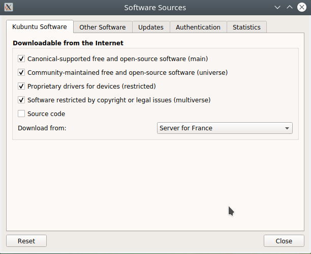
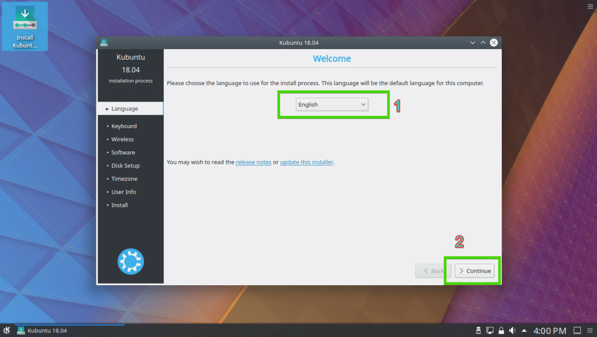

## Installation Kubuntu OS

1. Insert the bootable USB stick in your computer

2. Press the `delete` key to enter the bios.

3. Select it from your computer’s BIOS. You should see the GRUB menu as shown in the screenshot below. Just select `Start Kubuntu` and press `<Enter>`.

   

4. Click `Try Kubuntu`. (You can either start the `Install Kubuntu` or `Try Kubuntu` before installing. I prefer you try it before installing and if everything works, then you can go for the installation.) 

   

   Then you can look up the `Install Kubuntu` icon as marked on the screenshot below.

   

5. However, you have to do some work before installing OS. First, set the resolution to your monitor in the Displays Sytem setting module. 

6. Second, you should set the software source and repository update. Move to `the Updates-Discover menu` and Select `Settings` as shown in the screenshot blow.

   

   Check `Software restricted by copyright or legal issues`and set the Repository Download Server. (Download form : `repository server`) 

   

7. Updates.

### Install Kubuntu OS

   1. Click on the `Install Kubuntu` icon as marked on the screenshot below.

      

   2. Select your language and click on `Continue`.

      

   3. Select your keyboard layout and click on `Continue`.

   4. You can either select `Minimal installation` to install minimal version of Kubuntu or `Normal installation` to install the full version of Kubuntu. I recommend you to install `minimal version`.

   5. Select your disk format option and click on `Continue`.

   6. Select your timezone and click on `Continue`. If you want to change timezone after OS installation., you can change timezone on system settings.

   7. Type in your user information and click on `Continue`.

   8. The installation should start. Once the installation is complete, click on `Restart Now`.
