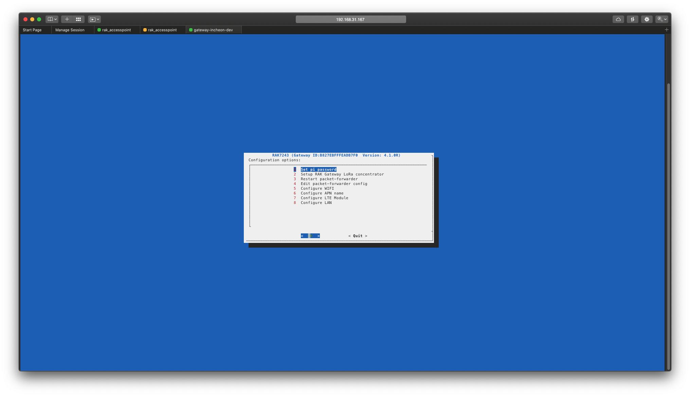

### Lora RAK7243C Pilot Gateway Configuration & connecting LTE Guide


#### 1. Burn the OS on Micro SD card (>8Gb) using Etcher tool

download os images : https://downloads.rakwireless.com/en/


#### 2. Booting the Gateway


#### 3. Connect the Access point of the Gateway(RAKwireless_XXXX)

Password : rakwireless


#### 4. Login ssh

User : pi, Password : raspberry


#### 5. Configure the Gateway

1. open the console to configure gateway

   ```sudo gateway-config```

   

   

2. Select a option : 8 Configure LAN

   1) Input static local IP address ( ex] 192.168.31.123)

   2) Input gateway address ( ex] 192.168.31.1)

   

3. Select a option : 5 Configure WiFi

   1) Choose AP mode or Client mode

   

4. Select a option : 2 RAK Gateway LoRa concentrator

   1) Choose platform (TTN or Chirpstack)

   2) Choose Frequency(US915, EU868 ...)

   3) Input the Loraserver address (if you choose Chirpstack on step 1)( ex] lora.farota.com)


#### 6 Configure LTE Module


1. ```sudo gateway-config``` -> Select a option : 6 APN name 

   Set the apn name that is compatible with your usim-card.

   Ex) lte150.ktfwing.com, lte.ktfwing.com : It's compatible with a KT lte usim card

2. Return terminal and input the commandline bellow

   ```bash
   sudo minicom -D /dev/ttyAMA0 -b 115200
   ```

   

3. Typing the commandline bellow and exit (CTRL+A -> Z(Skipable) -> Q)

   ```bash
   AT
   ok
   AT+COPS=?
   +COPS: .....,(1,"KT"(XXX),"KT","48200",2(YYY)) ,.....
   AT+COPS=1,0,XXX,YYY()
   ok
   ```

   

4. Return terminal and input the commandline bellow

   sudo pppd call gprs

   Then you will see a lot of log information, at the end of them, you can see some information like this:

   ```bash
   ...
   local IP address xxx.xxx.xxx.xxx
   remote IP address xxx.xxx.xxx.xxx
   primary DNS address xxx.xxx.xxx.xxx
   secondary DNS address xxx.xxx.xxx.xxx
   ...
   ```

   If you see the log above, it's a success. CTRL+c and  go to the next step.

   

5. Go to gateway configuration console and select a option : 7 Configure LTE Module

   ```bash
   sudo gateway-config
   ```

   1) Go to 7 Configure LTE Module

   2) Switch enable LTE 

   3) Exit and Reboot

   