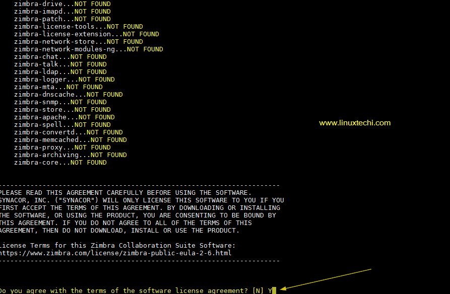
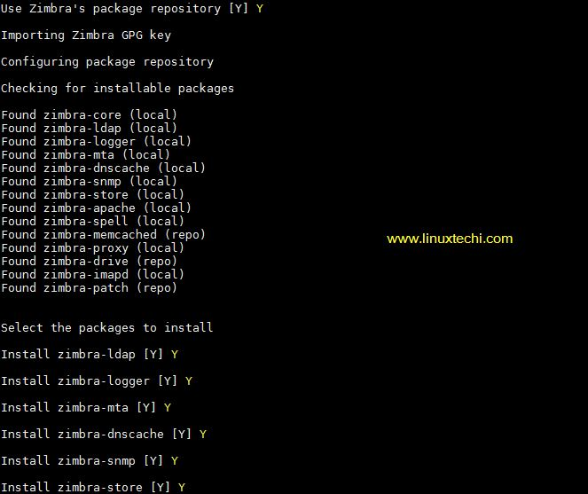
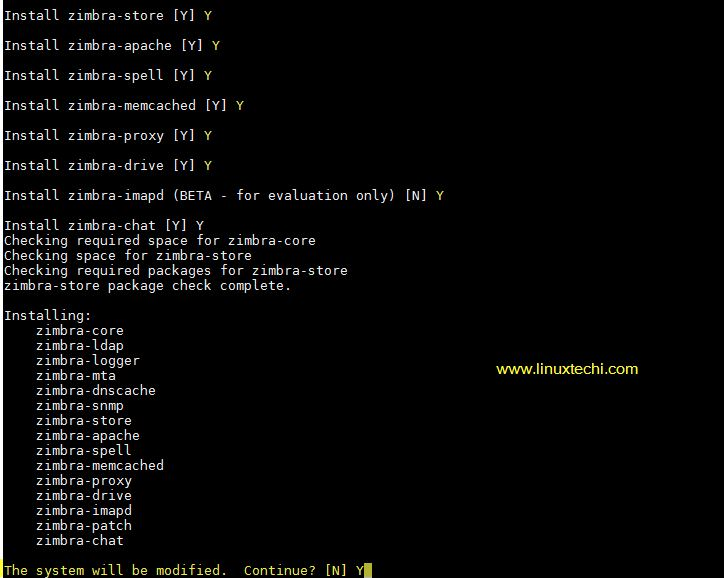
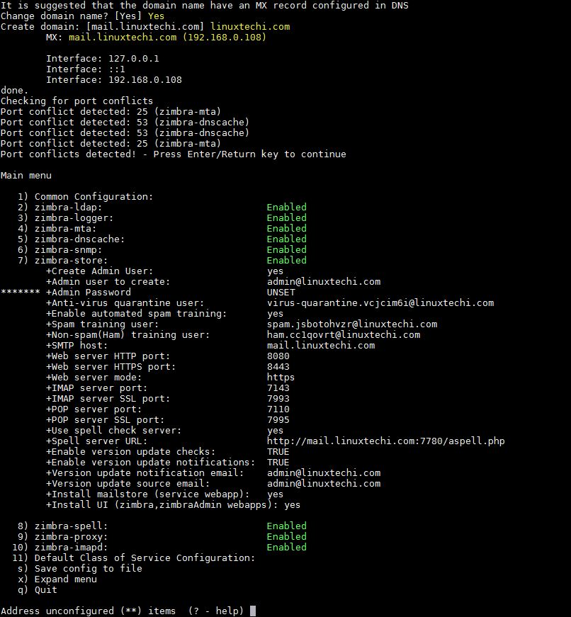
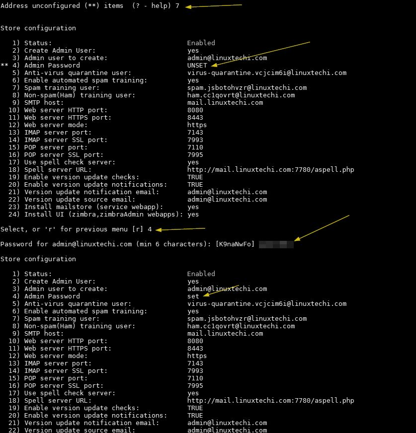
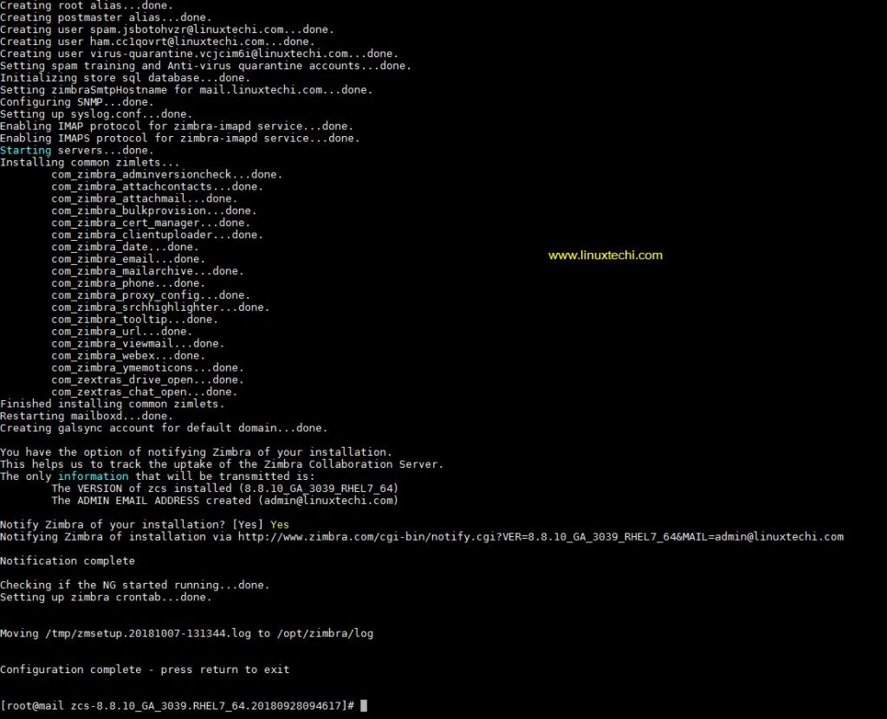

# Zimbra, Installation Guide


### Prerequisites of Zimbra Mail Server(ZCS)

1. install Minimal CentOS 7(>8 GB RAM)
2. A/MX Record for your server
3. FQDN, in my case it is "mail.smarf.kr"


### 1. Update repositories  and reboot.

```bash
~]# yum update -y ; reboot
```


### 2. Set A, MX record and hostname.

```bash
~]# hostnamectl set-hostname "mail.smarf.kr"
~]# exec bash
```

Add the following lines in  /etc/hosts file,

```tex
61.255.198.196 mail.smarf.kr mail
```

verify the A and MX record is configure for your domain using `dig` command.

```bash
[root@mail ~]# dig -t A mail.smarf.kr
[root@mail ~]# dig -t MX smarf.kr
```


### 3. Install Zimbra dependencies using yum and Download Zimbra.

Run the below command line to install Zimbra / ZCS dependencies in your directory.

```bash
[root@mail zimbra]# yum install unzip net-tools sysstat openssh-clients perl-core libaio nmap-ncat libstdc++.so.6 wget -y

[root@mail zimbra]# wget https://files.zimbra.com/downloads/8.8.10_GA/zcs-8.8.10_GA_3039.RHEL7_64.20180928094617.tgz --no-check-certificate
```


### 4. Install Zimbra (ZCS 8.8.10)

Extract the downloaded tgz file of ZCS 8.8.10.

```bash
[root@mail zimbra]# tar zxpvf zcs-8.8.10_GA_3039.RHEL7_64.20180928094617.tgz
```

Go to ZCS directory and run the install script.

```bash
[root@mail zimbra]# cd zcs-8.8.10_GA_3039.RHEL7_64.20180928094617
[root@mail zcs-8.8.10_GA_3039.RHEL7_64.20180928094617]# ./install.sh
```


Press `Y`



Use zimbra's package repository [Y] : Press `Y` and Select the packages that you want.





Press `Y`, After pressing `Y`, it will download the Zimbra and it may take long time depending on the internet speed.


Once Zimbra is installed the you will get the below window. 

Press `Yes` and Configure your domain and MX record. 



Now Press `4` to set Admin password.



After Store Configuration, Press `r` to go to previous menu and then press `a` to apply the changes and complete installation.




Open the ports in the firewall in case os firewall is running on your server.

```bash
[root@mail ~]# firewall-cmd --permanent --add-port={25,80,110,143,443,465,587,993,995,5222,5223,9071,7071}/tcp
success
[root@mail ~]# firewall-cmd --reload
success
```

Finished all steps, you can access Zimbra Mail Web `https://mail.smarf.kr`

### #. main Command lines for Zimbra Services and Tips

Run the below command to login zimbra user.

```bash
[root@mail ~]# su - zimbra
```


To controll the Zimbra Service. All the log files for Zimbra Server are stored in the directory `/var/log/zimbra.log`

```bash
# start || stop || restart || status
[zimbra@mail ~]$ zmcontrol start
```


#### How to set Zimbra drive in Zimbra server.

Configure NextColud URL and stop and start Zimbra server.

```bash
$ zmprov md farota.com zimbraDriveOwnCloudURL ' http://cloud.smarf.kr:8888'
$ zmcontrol stop
$ zmcontrol start
```


#### How to configure Outlook to connect ZMS.

Outlook configuration to connect ours mail-server.

- IMAP : 993:mail.farota.com(port:server-address)
- POP : 587:mail.farota.com(port:server-address)